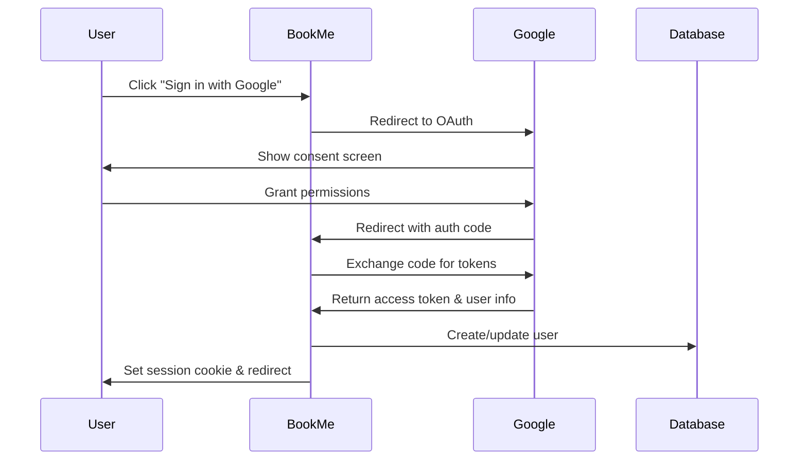

# Authentication

BookMe uses NextAuth.js v5 for authentication with support for multiple providers and session management.

## Overview

The authentication system supports:

- **Google OAuth** for business owners
- **Session-based authentication** for dashboard access
- **Public endpoints** for booking creation
- **Admin authentication** for platform management

## Authentication Flow

### Business Owner Authentication

1. **Login Request**: User clicks "Sign in with Google"
2. **OAuth Redirect**: User is redirected to Google OAuth
3. **Authorization**: User grants permissions
4. **Callback**: Google redirects back with authorization code
5. **Token Exchange**: Server exchanges code for access token
6. **User Creation**: User record is created/updated in database
7. **Session Creation**: Secure session is established
8. **Onboarding**: New users are redirected to onboarding flow



## Session Management

### Session Storage

Sessions are stored in the database using the `sessions` table:

```sql
CREATE TABLE biabook_session (
  sessionToken TEXT PRIMARY KEY,
  userId TEXT NOT NULL,
  expires INTEGER NOT NULL
);
```

### Session Cookie

- **Name**: `next-auth.session-token`
- **HttpOnly**: true
- **Secure**: true (production)
- **SameSite**: lax
- **Max Age**: 30 days

### Session Validation

```javascript
import { auth } from "@/server/auth";

export async function GET(request) {
  const session = await auth();

  if (!session) {
    return Response.json({ error: "Authentication required" }, { status: 401 });
  }

  // Access user data
  const userId = session.user.id;
  const userEmail = session.user.email;
}
```

## API Authentication

### Protected Endpoints

Most dashboard and admin endpoints require authentication:

```javascript
// Middleware example
export async function middleware(request) {
  const session = await auth();

  if (request.nextUrl.pathname.startsWith("/api/dashboard")) {
    if (!session) {
      return Response.json(
        { error: "Authentication required" },
        { status: 401 },
      );
    }
  }

  if (request.nextUrl.pathname.startsWith("/api/admin")) {
    if (!session || !session.user.isAdmin) {
      return Response.json({ error: "Admin access required" }, { status: 403 });
    }
  }
}
```

### Public Endpoints

These endpoints don't require authentication:

- `GET /api/businesses` - List businesses
- `GET /api/businesses/:slug` - Get business details
- `GET /api/businesses/:slug/services` - Get services
- `GET /api/businesses/:slug/availability` - Get availability
- `POST /api/bookings` - Create booking
- `GET /api/bookings/:confirmationNumber` - Get booking details

## User Roles and Permissions

### Business Owner

- Can manage their own business settings
- Can view and manage their appointments
- Can create and modify services
- Can set availability schedules

### Admin

- Can view all businesses and analytics
- Can manage business status
- Can access system health metrics
- Can manage notification queues

### Customer (No Account Required)

- Can view business listings
- Can create bookings
- Can view booking details with confirmation number
- Can cancel bookings within allowed timeframe

## Configuration

### Environment Variables

```bash
# NextAuth Configuration
NEXTAUTH_URL=https://your-domain.com
NEXTAUTH_SECRET=your-secret-key

# Google OAuth
GOOGLE_CLIENT_ID=your-google-client-id
GOOGLE_CLIENT_SECRET=your-google-client-secret

# Database
DATABASE_URL=your-database-url
```

### NextAuth Configuration

```javascript
// src/server/auth/config.ts
import { DrizzleAdapter } from "@auth/drizzle-adapter";
import { type NextAuthConfig } from "next-auth";
import Google from "next-auth/providers/google";
import { db } from "@/server/db";

export const authConfig = {
  adapter: DrizzleAdapter(db),
  providers: [
    Google({
      clientId: env.GOOGLE_CLIENT_ID,
      clientSecret: env.GOOGLE_CLIENT_SECRET,
    }),
  ],
  callbacks: {
    session: ({ session, user }) => ({
      ...session,
      user: {
        ...session.user,
        id: user.id,
        isOnboarded: user.isOnboarded,
      },
    }),
  },
  pages: {
    signIn: "/login",
    newUser: "/onboarding",
  },
} satisfies NextAuthConfig;
```

## Security Considerations

### CSRF Protection

NextAuth.js includes built-in CSRF protection:

- CSRF tokens are automatically generated and validated
- State parameter is used in OAuth flows
- Secure cookie settings prevent CSRF attacks

### Session Security

- Sessions use cryptographically secure random tokens
- Tokens are hashed before storage in database
- Automatic session rotation on sensitive operations
- Session expiry and cleanup

### OAuth Security

- PKCE (Proof Key for Code Exchange) is used when supported
- State parameter prevents CSRF attacks
- Nonce parameter prevents replay attacks
- Secure redirect URI validation

## Error Handling

### Authentication Errors

```javascript
// Handle authentication errors
export async function handleAuthError(error) {
  switch (error.type) {
    case "OAuthSignin":
      return "Error occurred during OAuth signin";
    case "OAuthCallback":
      return "Error occurred during OAuth callback";
    case "OAuthCreateAccount":
      return "Could not create OAuth account";
    case "EmailCreateAccount":
      return "Could not create email account";
    case "Callback":
      return "Error occurred during callback";
    case "OAuthAccountNotLinked":
      return "OAuth account is not linked to existing account";
    case "EmailSignin":
      return "Check your email for signin link";
    case "CredentialsSignin":
      return "Invalid credentials";
    case "SessionRequired":
      return "Please sign in to access this page";
    default:
      return "An error occurred during authentication";
  }
}
```

### Session Validation

```javascript
// Validate session in API routes
export async function validateSession(request) {
  const session = await auth();

  if (!session) {
    throw new Error("Authentication required");
  }

  if (!session.user.isOnboarded) {
    throw new Error("Onboarding required");
  }

  return session;
}
```

## Testing Authentication

### Mock Session for Testing

```javascript
// Test utilities
export function createMockSession(overrides = {}) {
  return {
    user: {
      id: "test-user-id",
      email: "test@example.com",
      name: "Test User",
      isOnboarded: true,
      ...overrides,
    },
    expires: new Date(Date.now() + 30 * 24 * 60 * 60 * 1000).toISOString(),
  };
}

// Mock auth for testing
jest.mock("@/server/auth", () => ({
  auth: jest.fn(() => Promise.resolve(createMockSession())),
}));
```

### Integration Tests

```javascript
// Test protected endpoints
describe("Protected API endpoints", () => {
  it("should require authentication", async () => {
    const response = await fetch("/api/dashboard/appointments");
    expect(response.status).toBe(401);
  });

  it("should allow authenticated requests", async () => {
    const response = await fetch("/api/dashboard/appointments", {
      headers: {
        Cookie: "next-auth.session-token=valid-session-token",
      },
    });
    expect(response.status).toBe(200);
  });
});
```
